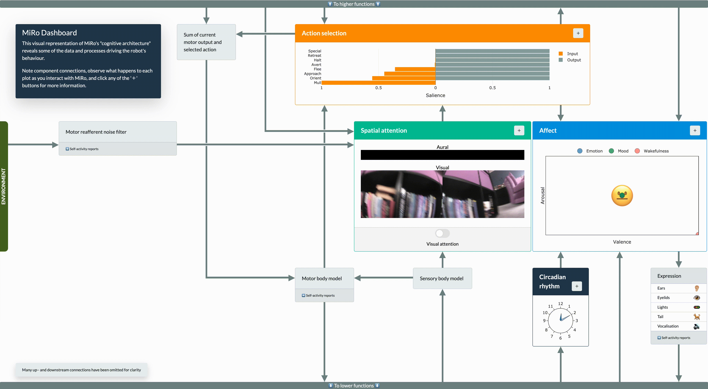
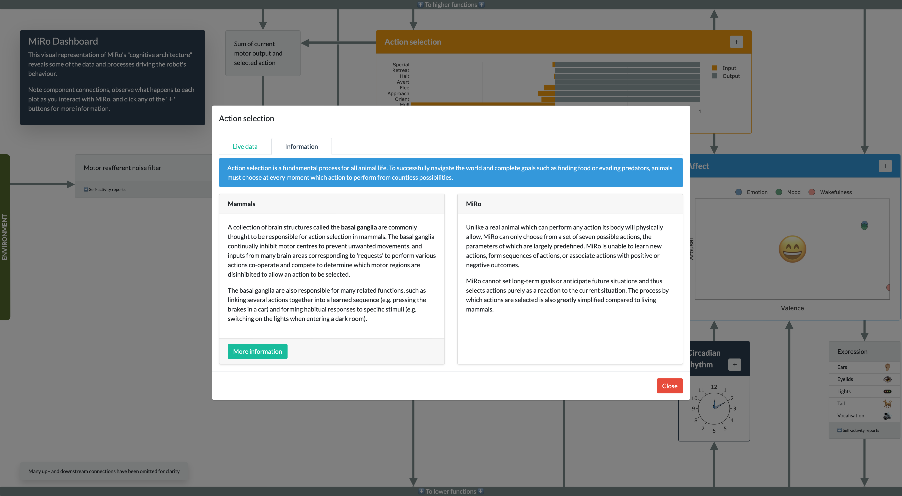

# MiRo dashboard

Interactive web dashboard displaying MiRo-E cognitive architecture with live data displays

MiRo is a biomimetic robot mammal with a cognitive architecture based on the mammalian brain (Mitchinson & Prescott, 2016). However, it is not normally possible to access the data and processes underlying this architecture that give rise to the robot's behaviour.

The MiRo dashboard allows users to observe these systems in action while they interact with the robot, giving insight and immediate feedback into the robot's actions and reactions. The dashboard also features short informational overlays to explain the similarities and differences between MiRo's cognitive architecture and that of a real mammal.

## Installation

The MiRo dashboard assumes you already have the latest [MiRo MDK](http://labs.consequentialrobotics.com/miro-e/software/) installed, either on your computer to run in simulation or on a physical MiRo robot.

You will also need to install `dash`, `dash-daq`, and `dash-bootstrap-components` for the web frontend, and `opencv-python-headless` for image processing. It's assumed you already have MDK prerequisites including `rospy` installed.

Clone the dashboard folder into `mdk/share/python/miro2/` and run `python app.py` to start the dashboard. The dashboard will be available at [localhost:8050](http://localhost:8050).

## Links

* [Plotly Dash](https://dash.plot.ly)
* [Dash Bootstrap components](https://dash-bootstrap-components.opensource.faculty.ai)

## References
Mitchinson, B., & Prescott, T. J. (2016). MIRO: A Robot 'Mammal' with a Biomimetic Brain-Based Control System. In N. F. Lepora, A. Mura, M. Mangan, P. F. M. J. Verschure, M. Desmulliez, & T. J. Prescott (Eds.), *Biomimetic and Biohybrid Systems* (Vol. 9793, pp. 179–191). Springer International Publishing. https://doi.org/10.1007/978-3-319-42417-0_17

## Acknowledgements

Dashboard design and code is based on the original [MiRo GUI](https://github.com/hamidehkerdegari/graphical_interface) by Hamideh Kerdegari.
